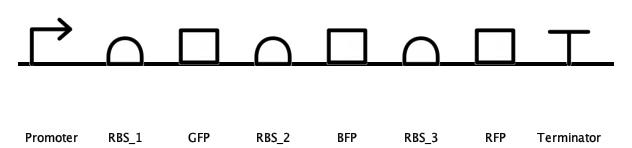

# M5-Team-4

## RBS strength optimisation on Opentrons OT-2

SBOL Schematic:

Aims:
- Optimise the system so that: [RFP] = [GFP] = [BFP]

Experiments:
- 8x Assemblies:
    - 1. Weak RBS control: all 3 RBS are the same strength part
    - 2. Strong RBS control
    - 3-8. Combinations of the 3 RBS strengths
- 1x Transformation control
- 1x WT control

Available RBS parts:
- 1-3: Typical iGem sequences
- A1-A12: BASIC RBSs, with a variety of UTR sequences.

